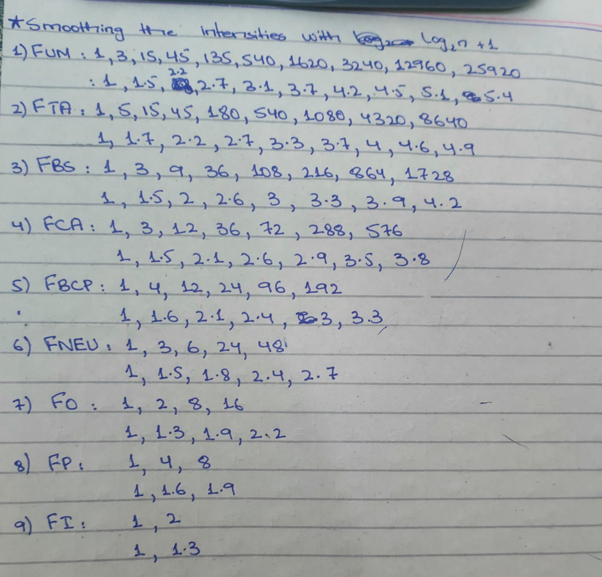
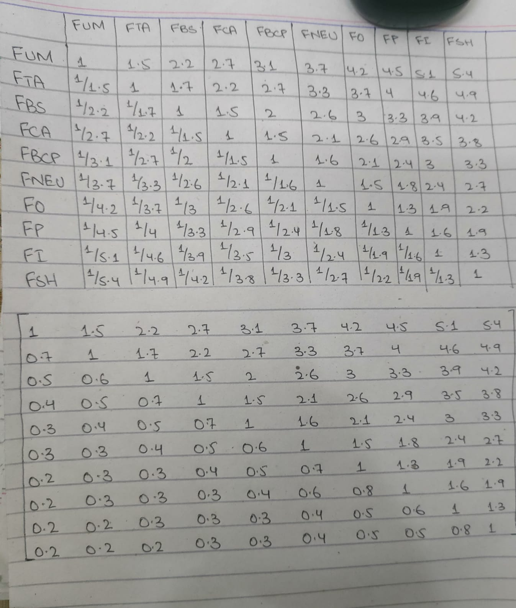
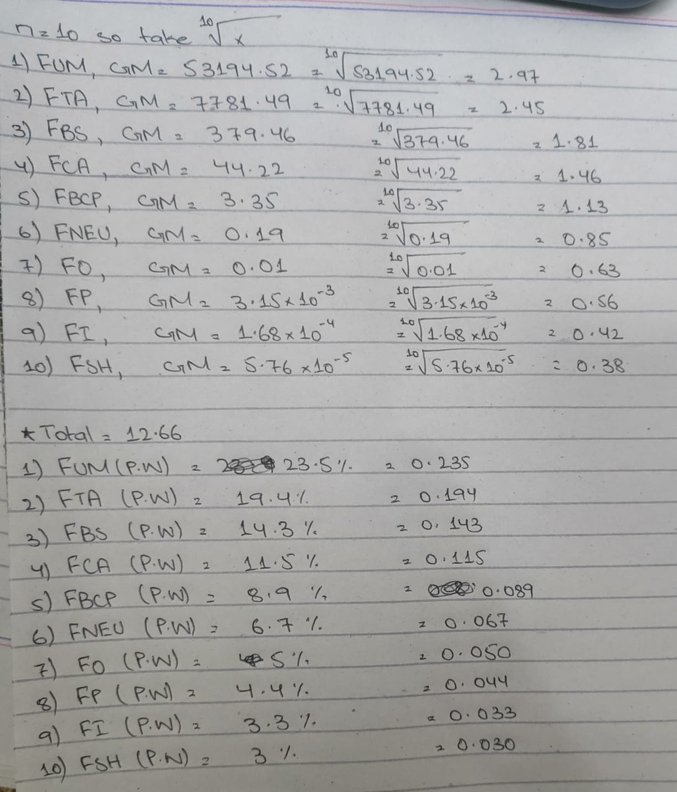
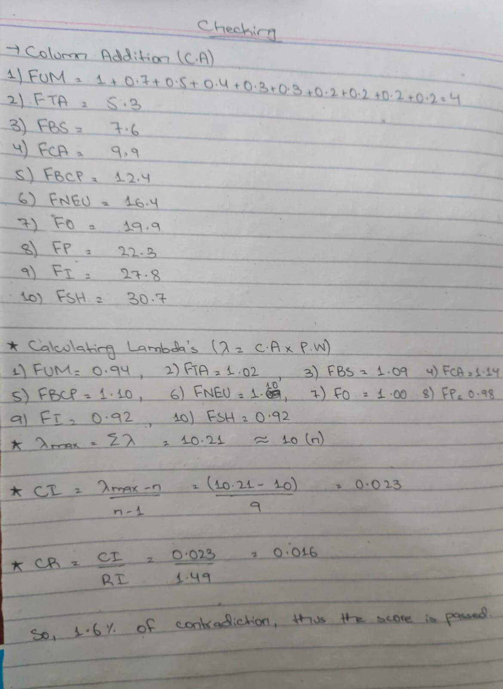
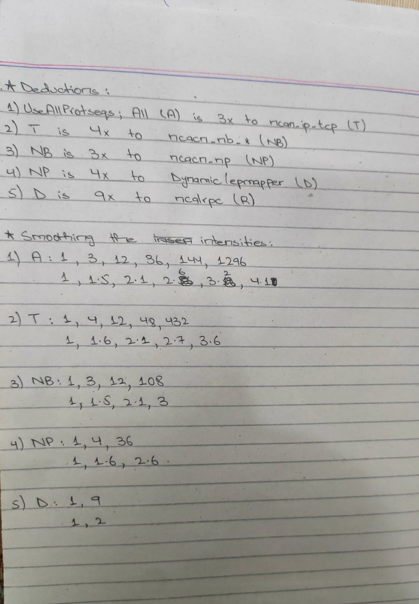
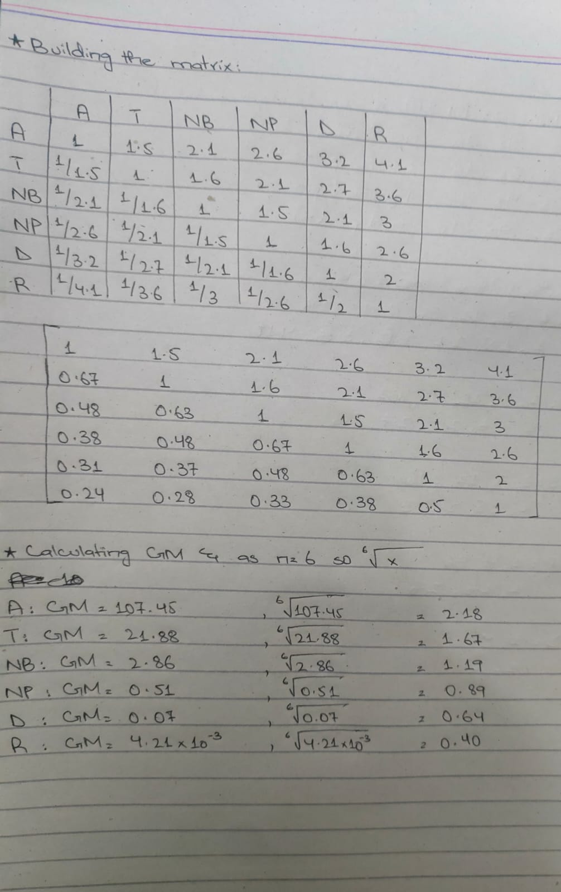
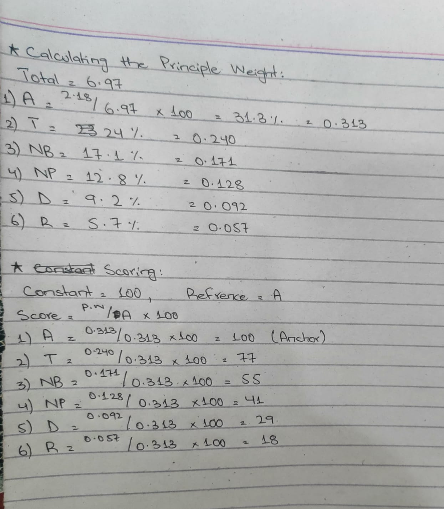
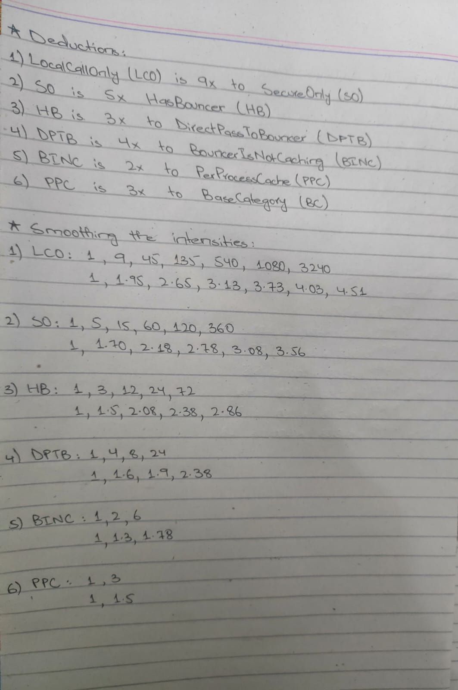
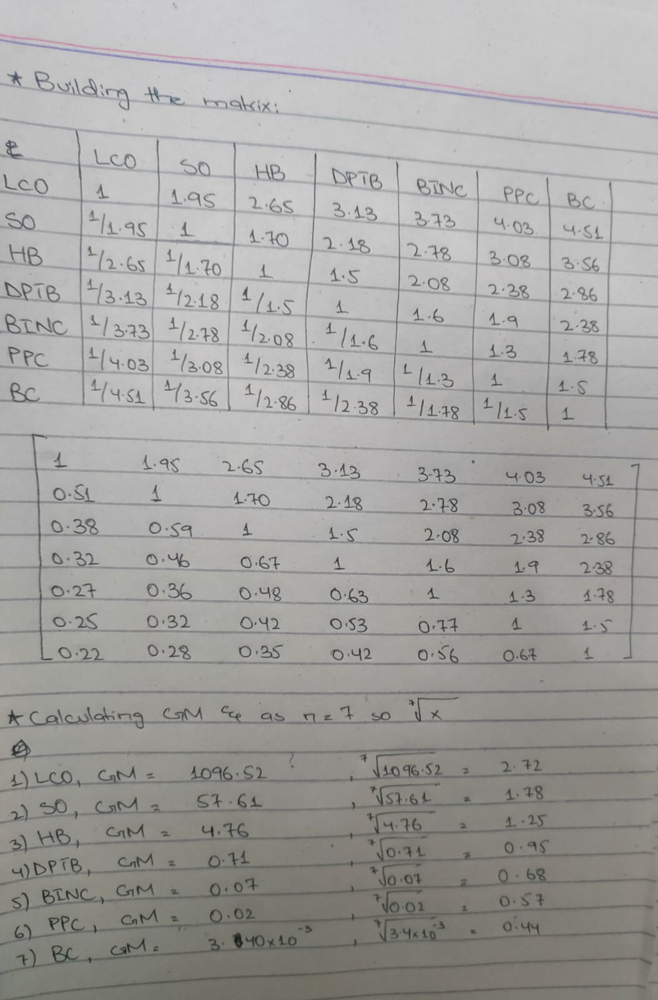
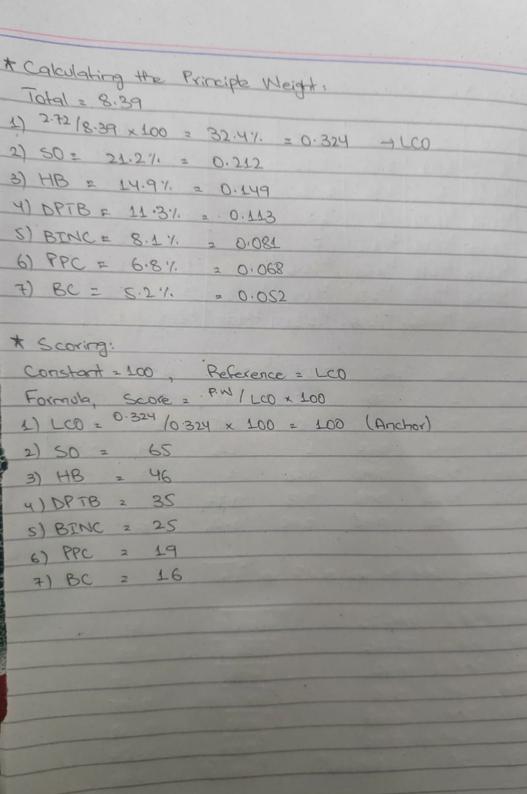

# Doing Math for SURFACE_SIGNAL_WEIGHT:

**Deductions (1v1) Using Saaty's Scale of Intensity:**
1) HasUserMarshal (FUM) is 3x HasTransmitAs (FTA)
2) FTA is 5x HasBogusStruct (FBS)
3) FBS is 3x HasCallerSizedBuffer (FCA)
4) FCA is 3x HasByteCountPointer (FBCP)
5) FBCP is 4x HasNonEncapUnion (FNEU)
6) FNEU is 3x HasObjectPointer (FO)
7) FO is 2x HasPipe (FP)
8) FP is 4x HasInterfacePointer (FI)
9) FI is 2x HasSystemhandle (FSH)

**Error Encountered:**
1) Now as we have this 1v1 comparison, we could easily sacle it to relative comparison i.e; FUM is 3x to FTA and FTA is 5x to FBS, so this means FUM is (3x5=15)x to FBS. Now Saaty scale of intensity caps at 9, so I forcefully capped any entry greater than 9 to 9. Now that spilled almost all of my right upper triangle of the matrix with 9's and I continued the math but it was known that error will occur as if i cap to 9 then in matrix it says FUM is 9x to FBS and also FUM is 9x to FSH, so this forecfully capping causes to land most of the entries at the same page and all the comparison was lost. I calculated and I got CR of > 25% which meant my deductions have contradictions upto 25%. Acceptable range is anywhere less than 10% so the approach was wrong.

2) Now, I thought that I wouldn't cap at 9, and will fill the matrix with original intensities. If I do so, then see what happens; the entries get very exponentially large i.e; FUM is 25920x to FI. That's clearly the overshoot and an overstatement. So, I have to drop that approach too.

**Solution:**
The mathematical solution to these kinds of problems is introducing a logarithmic scale (log10(n) + 1). What it does is compress exponential growth into a linear progression, so while the relative intensity between the variables is perfectly preserved, the numbers themselves don't overshoot. So I used this approach and to put it on test, I manually started the calculations. Now, I have attached the pic of my hand written check which might be messy so I apologize for it as you will see alot of my handwritten test pics as we progress ahead.

**Smoothing the intensities:**

Open handwritten calculation

**Building the matrix for AHP calculation:**

Open handwritten calculation

**Calculating Geometric Mean(GM), taking root of n & calculating the Principle Weight(PW):**

Open handwritten calculation

**Check:**

**Scoring:**
Now we got the contradiction of 1.6%, the passing bar was less than 10% so we are good to proceed on scoring the criteria. Now we have to first choose a constant and any criterion, a ceiling to which the other scores will be compared relatively. In mathematics for these relations, a ceiling of 100 is usually chosen and making FUM a ceiling is the logical choice here. The formula is:
Score = (Principle Weight/Reference) * Constant
1) FUM: (0.235/0.235) * 100 = 100 (Anchor)
2) FTA: (0.194/0.235) * 100 = 83
3) FBS: (0.143/0.235) * 100 = 61
4) FCA: (0.115/0.235) * 100 = 49
5) FBCP: (0.089/0.235) * 100 = 38
6) FNEU: (0.067/0.235) * 100 = 29
7) FO: (0.050/0.235) * 100 = 21
8) FP: (0.044/0.235) * 100 = 19
9) FI: (0.033/0.235) * 100 = 14
10) FSH: (0.030/0.235) * 100 = 13
So, in the dictionary in the code `SURFACE_SIGNAL_WEIGHT` constants comes from this calculation

---

# Doing Math for GATE_TRANSPORT_BASE:

**Deductions & Smoothing:**

Open handwritten calculation

**Matrix Building & Geometric Mean:**

Open handwritten calculation

**Principle Weight & Scoring:**

---

## Doing Math for GATE_MODIFIERS:

**Deductions & Smoothing:**

Open handwritten calculation

**Matrix Building & Geometric Mean:**

Open handwritten calculation

**Principle Weight & Scoring:**

`Note`: Here PPC value is a calculator slip and it was corrected to 21 in the original script
